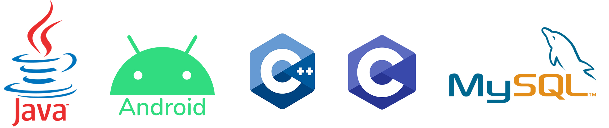
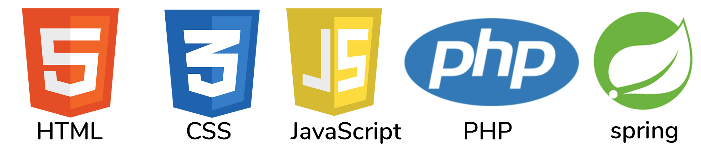

<h3 align="center">Hi</h3>
<h1 align="center">I'm Divyanshu Verma</h1>

<h3 align="center">Java, React and Android Developer</h3>
 

  
 
 

I'm a Android Developer and very confident Java SE developer. I love to work on various implementations using Java. I am also expert in C and CPP language. I am currently studying in 3rd year of college and learning more new stuffs to be a better programmer. I am still learning that's why my most repositories are private.I will make it public once my projects are finished.
 GOOD THINGS TAKES TIME 😉

  
<h3 align="center">Expertise</h3> 
 

  
 
 
 <h3 align="center">Enhancing</h3> 
  

    
  

  

  

<!--
**divyancod/divyancod** is a ✨ _special_ ✨ repository because its `README.md` (this file) appears on your GitHub profile.

Here are some ideas to get you started:

- 🔭 I’m currently working on ...
- 🌱 I’m currently learning ...
- 👯 I’m looking to collaborate on ...
- 🤔 I’m looking for help with ...
- 💬 Ask me about ...
- 📫 How to reach me: ...
- 😄 Pronouns: ...
- ⚡ Fun fact: ...
-->
